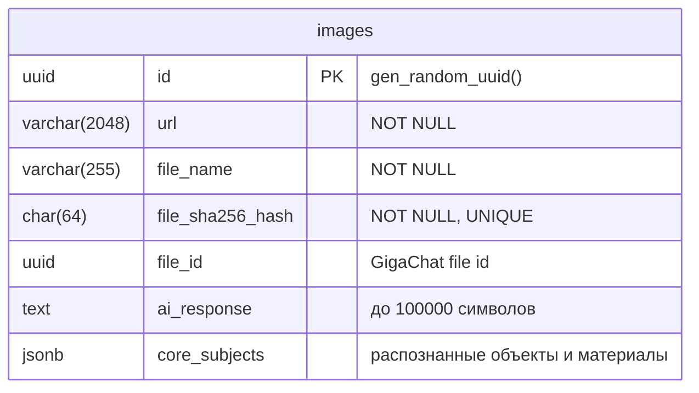

# Verbo Vision

Веб-API для анализа изображений с помощью GigaChat: определение объектов на фото, их материалов и уточнение по запросу пользователя.

## Описание проекта

**VerboVision** — тестовый проект на C# (.NET 9), Web API.

1. **Анализ изображения по URL** — приложение принимает ссылку на JPG, скачивает изображение, отправляет его в GigaChat и сохраняет результат (UUID запроса и список распознанных объектов с материалами) в PostgreSQL.
2. **Уточнения информации о предметах** — по UUID ранее сохранённого запроса и списку предметов (например: «ежедневник», «ручка») API запрашивает у GigaChat материалы для каждого предмета и возвращает структурированный ответ.

Используются: ASP.NET Core, Entity Framework Core, PostgreSQL, GigaChat API, Rate Limiting, Swagger, глобальная обработка ошибок.

---

## API (кратко)

| Метод | Endpoint | Описание |
|-------|----------|----------|
| GET   | `/Api/VerboVision/GetImageInfo?imageUrl=<url>` | Анализ изображения по URL (только JPG). Возвращает ID и список объектов с материалами. |
| POST  | `/Api/VerboVision/CheckImageInfo?requestId=<uuid>` + body `["предмет1", "предмет2"]` | Уточнение материалов по сохранённому запросу и списку предметов. |

Подробная документация и примеры запросов доступны в Swagger после запуска проекта.

---

## Схема базы данных

В приложении одна таблица `images` для хранения запросов анализа изображений.



**Таблица `images`:**

| Колонка           | Тип          | Описание                               |
|-------------------|--------------|----------------------------------------|
| `id`              | uuid (PK)    | Идентификатор записи (автогенерация)   |
| `url`             | varchar(2048)| URL изображения                        |
| `file_name`       | varchar(255) | Имя файла                              |
| `file_sha256_hash`| char(64)     | SHA-256 хеш файла (уникальный)         |
| `file_id`         | uuid         | ID файла в GigaChat                    |
| `ai_response`     | text         | Ответ AI (сырой текст)                 |
| `core_subjects`   | jsonb        | Объекты и материалы (JSON)             |

Индексы: `url` (btree), `file_sha256_hash` (btree, unique), `core_subjects` (gin).

---

## Промпты (в явном виде)

Используются два промпта к GigaChat.

### 1. Анализ изображения (объекты и материалы)

Промпт для отправки в GigaChat с целью анализа изображения и определения основных объектов и материалов, из которых эти объекты изготовлены:

```
Проанализируй объекты на изображении, выдели все важные материальные объекты (не людей, не животных или других живых существ). 
Выдели материалы (исходя из наиболее вероятного типа материала, относительно назначения объекта и требуемой прочности), из которых они состоят. 
Ответы списком в формате: объект:материал. Материалы выводи через запятую. 
Если ничего не найдешь, выведи: "Объекты не найдены:Материалы не найдены". Ответь кратко.
```

### 2. Определение материалов по списку предметов

Промпт для отправки в GigaChat с целью определения материалов указанных предметов. В промпт подставляется список предметов `{subjectsList}`:

```
Проанализируй и определи, из каких материалов сделаны следующие предметы: {subjectsList}.
Для каждого предмета верни ответ строго в формате: Название предмета: материал1, материал2, материал3
Например:
Ежедневник: бумага, картон, клей
Ручка: пластик, металл, чернила

Предметы для анализа:
{subjectsList}

Ответь кратко.
```

---

## Порядок запуска

### Требования

- .NET 9  
- PostgreSQL (или строка подключения к существующей БД)  
- Ключ авторизации GigaChat (см. [GigaChat API](https://developers.sber.ru/portal/products/gigachat-api))
- Сертификаты минцифры (см. [GigaChat API](https://developers.sber.ru/docs/ru/gigachat/certificates))

### 1. Настройка конфигурации

- В **appsettings.json** (или User Secrets в режиме разработки) задайте:
  - `PostgreSQL:ConnectionString` — строка подключения к PostgreSQL.
  - `GigaChat:AuthorizationKey` — ключ авторизации GigaChat.

Пример фрагмента (User Secrets или переменные окружения):

```json
{
  "PostgreSQL": {
    "ConnectionString": "Host=localhost;Database=verbo_vision;Username=user;Password=password"
  },
  "GigaChat": {
    "AuthorizationKey": "ваш_ключ"
  }
}
```

### 2. Запуск приложения

Из корня решения:

```bash
dotnet run --project VerboVision
```

Или в Visual Studio: установить **VerboVision** как стартовый проект и нажать F5.

В режиме **Development** приложение:

- Создаёт БД при первом запуске (`DatabaseManager.CreateAsync`).
- Поднимает Swagger UI по адресу: `https://127.0.0.1:<port>/swagger` (или `http://...` при отключённом HTTPS).

### 3. Запуск тестов

```bash
dotnet test VerboVision.Tests
```

---